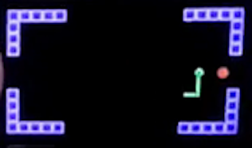

# Pico Snake
Written in MicroPython for Raspberry Pi Pico and Pimoroni Pico Display

## Animated GIF Preview (12 fps)

*  [Download Longer MP4 Preview (2.5 MB)](https://github.com/coding418/pico-snake/blob/main/vid/pico-snake.mp4?raw=true)

## Requirements
### Hardware:

*  [Raspberry Pi Pico](https://www.raspberrypi.org/products/raspberry-pi-pico/)

*  [Pimoroni Pico Display](https://shop.pimoroni.com/products/pico-display-pack)

### Software:

*  [Custom MicroPython image by Pimoroni (includes picodisplay library)](https://github.com/pimoroni/pimoroni-pico/releases)

## Classes
### Game
* Manages the main game data and functionality.
	* Attributes include: 
		* score
		* game states (e.g. title screen, playing, game over)  
	* Methods include:
		* initialize level data
		* update game
		* get user input
		* draw game objects

### Snake
* A singly-linked list to represent the Snake.
	* Attributes include:
		* pointer to "head" SnakeNode
		* current direction
	* Methods include:
		* push new head node
		* pop tail node
		* check if co-ordinate occupied by a SnakeNode
		* update direction
		* draw entire Snake
		* draw green line between two SnakeNodes

### SnakeNode
* Single node in the Snake linked list. 
	* Attributes:
		* position
		* direction
		* pointer to next node in list

### Food
* Represents food for the Snake. 
	* Attribute: 
		* position
	* Methods:
		* draw food
		* reset position to random location (always ensures new position is not inside Snake or walls)

### Level
* Represents the game arena.
	* Attribute:
		* array of wall positions
	* Methods:
		* load wall positions from txt file
		* draw walls
		* check for collisions with walls

## Designing Levels
* Each level is a 20x11 grid of cells.
* Each cell in the grid can contain:
	* a SnakeNode
	* a piece of Food
	* a wall
	* nothing
* The "positions" of SnakeNodes, Food, and walls are defined in terms of this grid of cells:
	* `( 0,  0)` top-left 
	* `(19,  0)` top-right 
	* `( 0, 10)` bottom-left
	* `(19, 10)` bottom-right 
* Levels are designed through a txt file:
	* Each line represents a row
	* Each character represents a cell
* The first 20 chars of the first 11 lines comprise the grid:
	* any chars or lines outside that range are currently ignored
	* extra parameters for each level could easily be added after line 11:
		* E.g. a target score to pass each level (currently hard-coded as 5 to simplify debugging)
	* The '0' char (zero) represents a wall
	* The ' ' char (space) represents an empty cell
		* Currently any char other than '0' represents an empty cell since all other chars are ignored
		* It would be relatively simple to add different wall types or level objects since they would just be defined with another char

For example, the file level-2.txt contains the following text:
<pre>
00000          00000
0                  0
0                  0
0                  0
                    
                    
                    
0                  0
0                  0
0                  0
00000          00000
</pre>

Which creates the following level:

